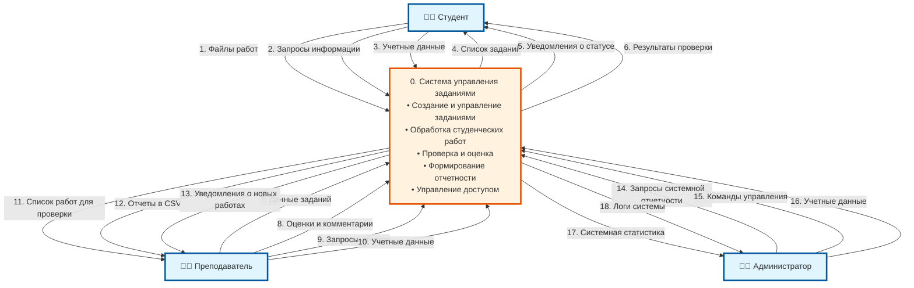

# DFD Диаграмма уровня 0 (Контекстная) - Система управления заданиями

## Контекстная диаграмма (DFD уровня 0)

Контекстная диаграмма показывает систему как единый процесс с внешними сущностями и основными потоками данных.

## Описание потоков данных

### Потоки от Студента:
1. **Файлы работ** - загружаемые файлы (PDF, DOCX, ZIP)
2. **Запросы информации** - запросы о статусе работ, заданиях
3. **Учетные данные** - логин, пароль для входа в систему

### Потоки к Студенту:
4. **Список заданий** - доступные для выполнения задания
5. **Уведомления о статусе** - информация об изменениях статуса работ
6. **Результаты проверки** - оценки, комментарии преподавателя

### Потоки от Преподавателя:
7. **Данные заданий** - название, описание, дедлайн, критерии
8. **Оценки и комментарии** - результаты проверки работ
9. **Запросы отчетов** - запросы на формирование отчетности
10. **Учетные данные** - данные для входа в систему

### Потоки к Преподавателю:
11. **Список работ для проверки** - работы студентов, ожидающие проверки
12. **Отчеты в CSV** - сгенерированные отчеты об успеваемости
13. **Уведомления о новых работах** - оповещения о сданных работах

### Потоки от Администратора:
14. **Запросы системной отчетности** - запросы общей статистики
15. **Команды управления** - управление пользователями, настройки
16. **Учетные данные** - данные для входа в систему

### Потоки к Администратору:
17. **Системная статистика** - общая статистика использования системы
18. **Логи системы** - журнал событий и ошибок

## Связь с DFD уровня 1

Контекстная диаграмма (уровень 0) показывает систему как единое целое, а DFD уровня 1 детализирует внутренние процессы системы, разбивая процесс "0. Система управления заданиями" на 5 подпроцессов:

- 1. Управление заданиями
- 2. Обработка студенческих работ  
- 3. Проверка и оценка работ
- 4. Формирование отчетности
- 5. Управление доступом

## Принципы построения

✅ **Балансировка данных** - все входные и выходные потоки уровня 0 соответствуют потокам уровня 1  
✅ **Нумерация потоков** - каждый поток имеет уникальный номер  
✅ **Четкие названия** - все потоки имеют описательные названия  
✅ **Внешние сущности** - определены все взаимодействующие с системой сущности  
✅ **Единый процесс** - система представлена как один процесс на контекстном уровне
